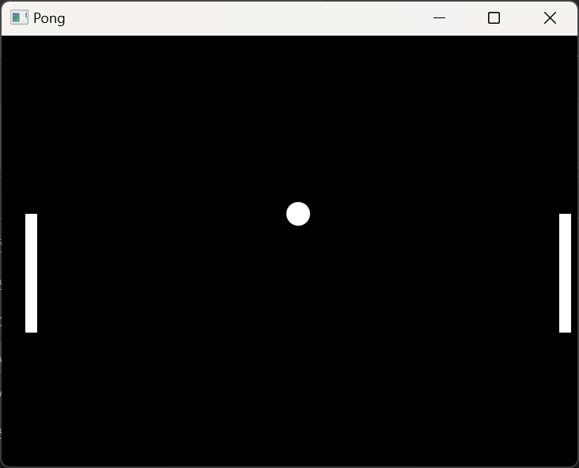

# WPF Pong Game

This is a simple implementation of the classic game Pong using Windows Presentation Foundation (WPF) in C#. The game allows one player to control a paddle on the left side of the screen using the 'W' and 'S' keys, while the other player is controlled by the computer. The aim of the game is to hit the ball with the paddle and prevent it from crossing to the opponent's side.

## Requirements

To run this game, you will need:

- Microsoft Visual Studio with support for C# and WPF development
- .NET Framework 6.0 or higher

## Installation

1. Clone or download the game's source code.
2. Open the solution file (`Pong.sln`) in Visual Studio.
3. Build the solution by selecting "Build" > "Build Solution" from the menu bar.
4. Run the game by selecting "Debug" > "Start Debugging" from the menu bar or by pressing `F5`.

## Gameplay

- Use the `W` and `S` keys to move the left paddle up and down.
- The left paddle is controlled by the computer and will automatically move to try and hit the ball.
- The game ends when the player chooses to quit.
- After the game is over, the player can choose to play again or quit.

## Screenshot

